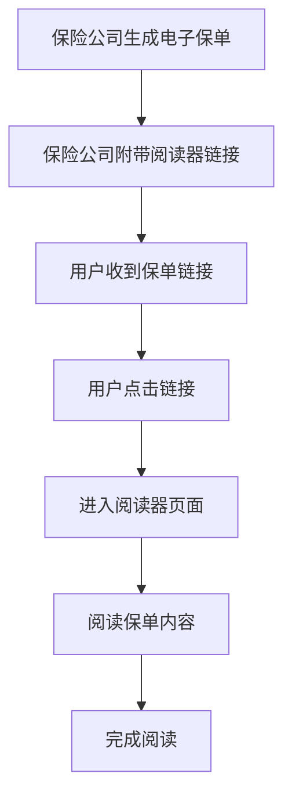
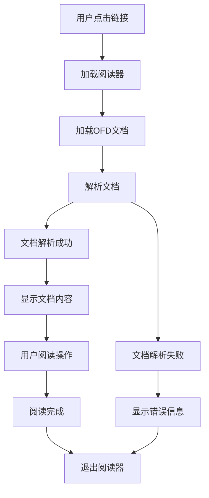

# OFD Reader 轻阅读 - 产品需求说明书

## 1. 版本记录
| 版本 | 日期 | 作者 | 变更内容 | 审批人 |
|------|------|------|----------|--------|
| V1.0 | 2026-04-10 | 产品经理 | 初始版本 | - |
| V1.1 | 2026-04-10 | 产品经理 | 调整为保险公司使用场景，简化功能 | - |
| V1.2 | 2026-04-10 | 产品经理 | 根据反馈调整文档结构 | - |

## 2. 需求背景与产品目标

### 2.1 需求背景
- OFD（Open Fixed-layout Document）是我国自主研发的电子文档格式标准，广泛应用于政府、企业等领域的电子文件交换
- 保险公司在发送电子保单时，需要为用户提供便捷的阅读方式，避免用户下载专用软件的繁琐流程
- 目前市场上缺乏专门针对保险公司场景的Web端OFD阅读器，无法满足保单阅读的特定需求

### 2.2 目标用户
- **保险公司**：作为B端客户，需要为终端用户提供便捷的保单阅读工具
- **保险用户**：作为终端用户，需要方便地阅读保险公司发送的OFD格式电子保单

### 2.3 产品目标
- 提供轻量级Web端OFD文档阅读体验，无需安装专用软件
- 支持OFD电子保单的完整阅读功能，包括文本、图片、表格等元素的正确显示
- 实现流畅的阅读操作，如页面导航、缩放、搜索等
- 满足OFD电子保单行业规范的阅读要求

### 2.4 量化价值
- **提升用户体验**：用户无需下载安装软件，直接通过链接打开保单，减少操作步骤
- **降低保险公司成本**：无需开发专用阅读软件，减少技术投入
- **提高保单阅读率**：简化阅读流程，增加用户阅读保单的意愿
- **增强品牌形象**：提供专业、便捷的保单阅读体验，提升保险公司品牌形象

## 3. 产品范围与名词解释

### 3.1 产品范围
- **核心功能**：OFD文档阅读、页面导航、缩放、搜索、关键字高亮、重要条款标记、数字签名验证等保单阅读相关功能
- **技术范围**：Web端应用，支持主流浏览器，响应式设计适配不同设备
- **非产品范围**：用户注册登录、阅读历史记录、个性化设置、文档云存储、文档编辑、格式转换等功能

### 3.2 名词解释
| 术语 | 解释 |
|------|------|
| OFD | Open Fixed-layout Document，开放版式文档格式，我国自主研发的电子文档格式标准 |
| 电子保单 | 以电子形式存在的保险合同，具有与纸质保单同等的法律效力 |
| 版式文档 | 保持文档原始格式和布局的电子文档，如PDF、OFD等 |
| 响应式设计 | 根据设备屏幕尺寸自动调整布局的设计方法，确保在不同设备上都有良好的显示效果 |
| Web Worker | 在后台运行的JavaScript线程，用于处理耗时操作，避免阻塞主线程 |
| 数字签名 | 用于验证文档真实性和完整性的电子签名技术 |

## 4. 产品总体说明

### 4.1 业务流程图

### 4.2 阅读模式说明
- **在线阅读**：用户通过链接直接在浏览器中阅读OFD电子保单，无需下载
- **嵌入阅读**：阅读器可嵌入到保险公司的官方网站或APP中，提供一体化体验

### 4.3 状态流程图

## 5. 产品功能描述

### 5.1 阅读器核心功能

#### 5.1.1 文档加载与显示
- **功能描述**：通过URL参数加载指定的OFD电子保单文档并显示
- **操作流程**：用户点击链接 → 阅读器加载文档 → 解析文档内容 → 显示文档
- **页面元素**：文档显示区域、加载进度条、错误提示
- **交互逻辑**：
  - 自动加载URL参数指定的OFD文档
  - 显示加载进度
  - 加载失败时显示错误信息
  - 支持文档内容的完整显示，包括文本、图片、表格等

#### 5.1.2 页面导航
- **功能描述**：提供多种方式浏览文档页面
- **操作流程**：用户使用导航控件 → 跳转到指定页面
- **页面元素**：上一页/下一页按钮、页码输入框、目录导航
- **交互逻辑**：
  - 支持鼠标滚轮滚动翻页
  - 支持键盘方向键翻页
  - 点击上一页/下一页按钮翻页
  - 输入页码直接跳转到指定页面
  - 点击目录项跳转到对应章节

#### 5.1.3 阅读控制
- **功能描述**：提供缩放、搜索、高亮等阅读辅助功能
- **操作流程**：用户使用工具栏控件 → 执行相应操作
- **页面元素**：缩放按钮、搜索框、高亮按钮、全屏按钮
- **交互逻辑**：
  - 支持放大/缩小文档内容
  - 支持全文搜索功能
  - 支持关键字高亮显示
  - 支持全屏阅读模式
  - 支持文档旋转

#### 5.1.4 保单特定功能
- **功能描述**：针对保险保单的特定阅读需求
- **操作流程**：用户使用保单特定功能 → 查看相关信息
- **页面元素**：重要条款标记、保单信息摘要、下载按钮、数字签名验证
- **交互逻辑**：
  - 自动标记保单中的重要条款
  - 显示保单关键信息摘要
  - 支持下载原始OFD文档
  - 支持打印功能
  - 支持验证保单的数字签名

## 6. 用户界面设计

### 6.1 设计风格
- **主色调**：#4A90E2（蓝色）、#FFFFFF（白色背景）
- **辅助色**：#50E3C2（绿色，用于成功状态）、#FF6B6B（红色，用于错误状态）
- **按钮风格**：圆角矩形，轻微阴影，悬停效果
- **字体**：系统默认无衬线字体，标题16-20px，正文14px，辅助文字12px
- **布局风格**：简洁明了，专注于文档内容，适当留白
- **图标风格**：线性图标，简洁现代

### 6.2 页面设计概览
| 页面名称 | 模块名称 | UI元素 |
|---------|---------|--------|
| 阅读器页面 | 文档显示区域 | 中央大区域，白色背景，文档内容清晰显示，页码指示器 |
| 阅读器页面 | 顶部工具栏 | 包含缩放、搜索、全屏、下载等图标按钮 |
| 阅读器页面 | 底部导航栏 | 包含页码输入框、上一页/下一页按钮、目录按钮 |
| 阅读器页面 | 侧边栏 | 可折叠的目录导航，重要条款列表 |

### 6.3 响应式设计
- **设计原则**：桌面优先，同时支持平板和移动设备
- **断点设置**：1200px（桌面）、768px（平板）、480px（手机）
- **适配策略**：
  - 桌面端：完整功能，侧边栏展开
  - 平板端：核心功能保持，侧边栏可折叠
  - 移动端：简化界面，工具栏折叠，优先保证文档显示
- **触摸优化**：增大点击区域，支持手势操作（如双指缩放）

### 6.4 无障碍设计
- 支持键盘导航
- 支持屏幕阅读器
- 提供足够的颜色对比度
- 清晰的视觉反馈
- 合理的焦点状态

## 7. 技术要求

### 7.1 前端技术
- **框架**：React@18 + TypeScript
- **构建工具**：Vite
- **样式**：Tailwind CSS
- **OFD解析**：ofd.js或类似库
- **状态管理**：React Context API
- **路由**：React Router

### 7.2 性能要求
- 页面加载时间：首屏加载时间 < 2秒
- 文档解析时间：< 5秒（对于100页以内的文档）
- 内存使用：< 500MB
- 支持同时在线用户数：> 1000

### 7.3 安全要求
- 文件类型验证：确保只处理OFD格式文件
- 防止XSS攻击：对用户输入进行过滤
- 数据加密：敏感保单信息传输加密
- 访问控制：可配置的访问权限控制

### 7.4 行业规范要求
- 符合OFD电子保单行业规范的阅读要求
- 支持电子签名验证（如果保单包含签名）
- 确保文档显示的准确性和完整性