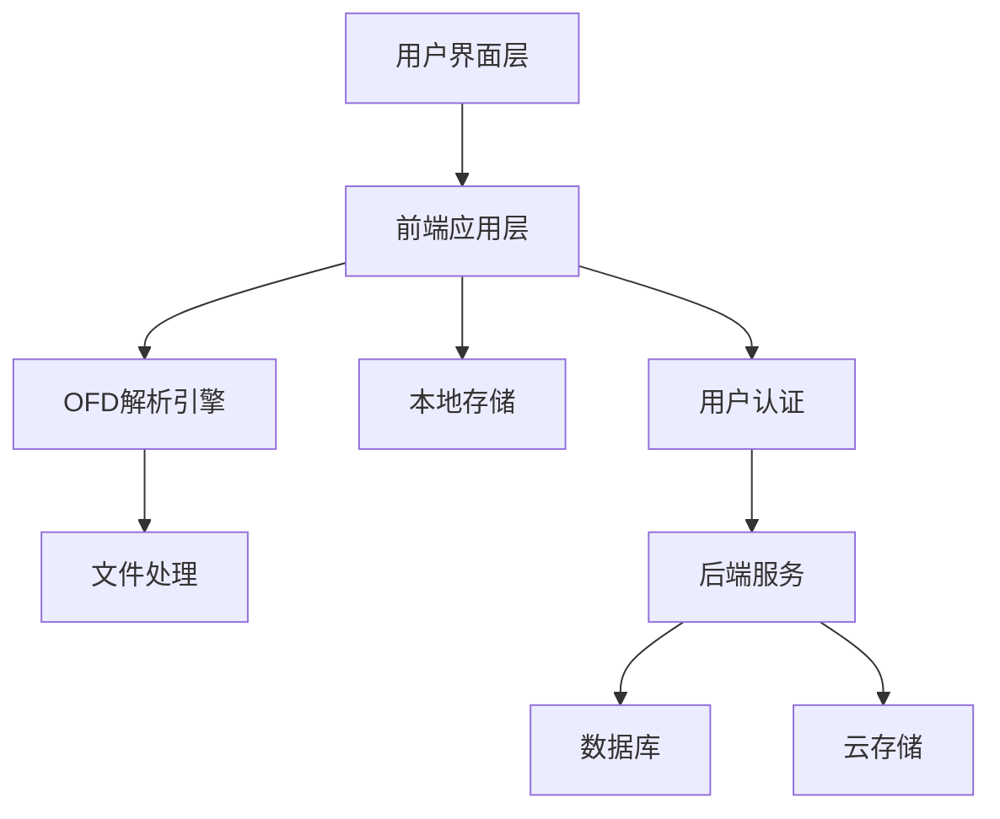
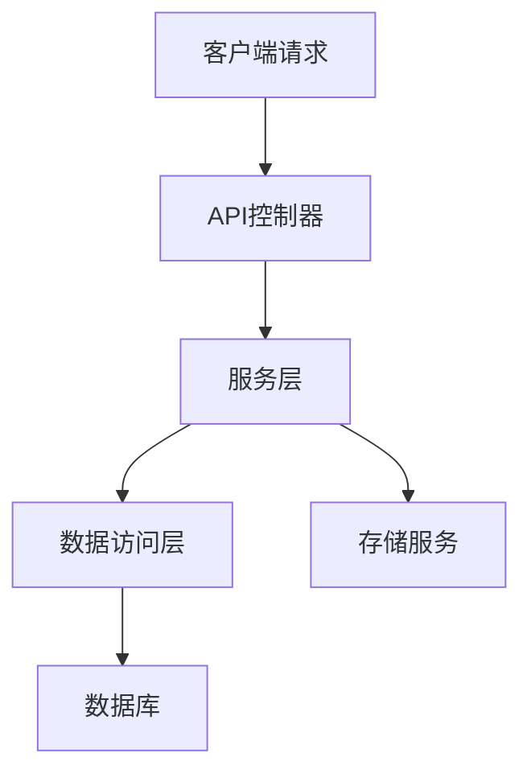
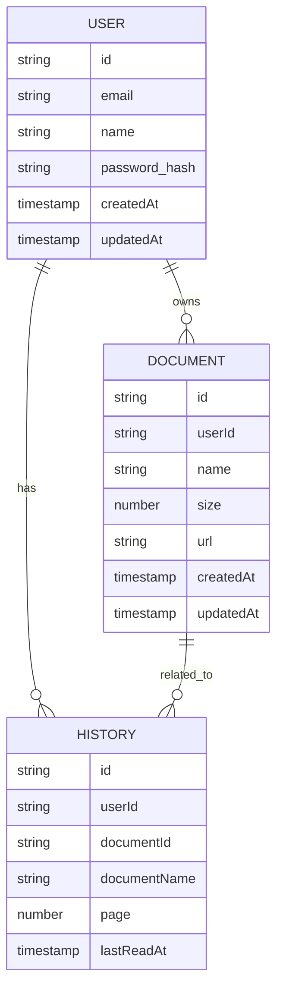

# OFD Reader 轻阅读 - 技术架构文档

## 1. Architecture Design


## 2. Technology Description
- 前端：React@18 + TypeScript + Tailwind CSS + Vite
- 构建工具：Vite
- OFD解析：使用ofd.js或类似的OFD解析库
- 本地存储：localStorage/IndexedDB（用于缓存和历史记录）
- 用户认证：Firebase Auth或自定义JWT认证
- 后端（可选）：Node.js + Express（用于用户管理和云存储）
- 数据库（可选）：MongoDB或PostgreSQL（用于用户数据和文档元数据）
- 云存储（可选）：AWS S3或类似服务（用于存储用户文档）

## 3. Route Definitions
| Route | Purpose |
|-------|---------|
| / | 首页，文件上传和最近阅读 |
| /reader/:id | 阅读器页面，展示OFD文档 |
| /profile | 个人中心，用户信息和设置 |
| /login | 登录页面 |
| /register | 注册页面 |

## 4. API Definitions
### 4.1 认证相关API
| Endpoint | Method | Description | Request Body | Response |
|----------|--------|-------------|--------------|----------|
| /api/auth/register | POST | 用户注册 | {email, password, name} | {id, email, name, token} |
| /api/auth/login | POST | 用户登录 | {email, password} | {id, email, name, token} |
| /api/auth/me | GET | 获取当前用户信息 | N/A | {id, email, name} |

### 4.2 文档相关API
| Endpoint | Method | Description | Request Body | Response |
|----------|--------|-------------|--------------|----------|
| /api/documents | GET | 获取用户文档列表 | N/A | [{id, name, size, createdAt}] |
| /api/documents | POST | 上传文档 | FormData | {id, name, size, url} |
| /api/documents/:id | GET | 获取文档详情 | N/A | {id, name, size, url, metadata} |
| /api/documents/:id | DELETE | 删除文档 | N/A | {success: true} |

### 4.3 阅读历史API
| Endpoint | Method | Description | Request Body | Response |
|----------|--------|-------------|--------------|----------|
| /api/history | GET | 获取阅读历史 | N/A | [{documentId, documentName, lastReadAt, page}] |
| /api/history | POST | 添加阅读历史 | {documentId, documentName, page} | {id, documentId, documentName, lastReadAt, page} |
| /api/history/:id | DELETE | 删除阅读历史 | N/A | {success: true} |

## 5. Server Architecture Diagram


## 6. Data Model
### 6.1 Data Model Definition


### 6.2 Data Definition Language
#### 用户表
```sql
CREATE TABLE users (
    id VARCHAR(255) PRIMARY KEY,
    email VARCHAR(255) UNIQUE NOT NULL,
    name VARCHAR(255) NOT NULL,
    password_hash VARCHAR(255) NOT NULL,
    created_at TIMESTAMP DEFAULT CURRENT_TIMESTAMP,
    updated_at TIMESTAMP DEFAULT CURRENT_TIMESTAMP
);
```

#### 文档表
```sql
CREATE TABLE documents (
    id VARCHAR(255) PRIMARY KEY,
    user_id VARCHAR(255) REFERENCES users(id),
    name VARCHAR(255) NOT NULL,
    size BIGINT NOT NULL,
    url VARCHAR(255) NOT NULL,
    created_at TIMESTAMP DEFAULT CURRENT_TIMESTAMP,
    updated_at TIMESTAMP DEFAULT CURRENT_TIMESTAMP
);
```

#### 阅读历史表
```sql
CREATE TABLE history (
    id VARCHAR(255) PRIMARY KEY,
    user_id VARCHAR(255) REFERENCES users(id),
    document_id VARCHAR(255) REFERENCES documents(id),
    document_name VARCHAR(255) NOT NULL,
    page INTEGER NOT NULL,
    last_read_at TIMESTAMP DEFAULT CURRENT_TIMESTAMP
);
```

## 7. 技术实现要点
### 7.1 OFD解析实现
- 使用ofd.js库解析OFD文件结构
- 实现文档渲染，支持文本、图片等元素的正确显示
- 处理文档中的字体和样式，确保显示效果与原始文档一致

### 7.2 性能优化
- 实现文档分页加载，避免一次性加载整个文档
- 使用Web Worker处理OFD解析，避免阻塞主线程
- 实现文档缓存策略，提高重复阅读时的加载速度

### 7.3 安全性
- 实现文件类型验证，确保只处理OFD格式文件
- 对上传文件进行病毒扫描（可选）
- 实现用户认证和授权，保护用户文档安全

### 7.4 响应式设计
- 使用Tailwind CSS实现响应式布局
- 针对不同设备优化阅读体验
- 支持触摸设备的手势操作

### 7.5 离线支持
- 实现PWA（渐进式Web应用），支持离线访问
- 缓存已阅读的文档，提高离线阅读体验